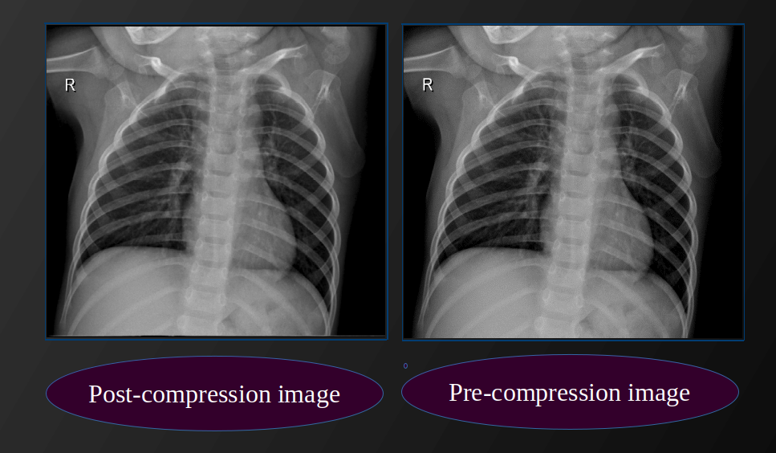

# Data Structures (SBE201) - Spring 2020

## Huffman-Encoding
Huffman encoding is a common compression algorithm that reduces the data size to allow saving space when storing the data or transmitting data over the network efficiently. It also guarantees complete restor- ing of the original data, hence it is classified as a lossless compression algorithm. The concept of compression is applied on different kind of data, for example images might be compressed using JPG algorithm (lossy) or PNG algorithm (lossless).



## User Manual
To run the program

* To compress the image type in terminal
```
# compress
./compress imagePath
```
Example usage:
```
./compress image.pgm # generates image.enc and image.frq
```
* To decompress the image type in terminal
```
# decompress
./compress EncodedimagePath -t FrequencyTablePath
```
Example usage:
```
./compress image.enc -t image.frq # generates image.pgm
```


## Tools
* [cxxopts](https://github.com/jarro2783/cxxopts) library for command line arguments parsing.
* Qt creator for creating the GUI.

## Contributors
* Amany Yaser
* Aya Ehab [(ayaehab)](https://github.com/ayaehab)
* Aya Abdulrazzaq [(ayalderson)](https://github.com/ayalderson)
* Salma Haytham [(Salma-H)](https://github.com/Salma-H)
* Awatef Ahmed [awatef-ahmed](https://github.com/awatef-ahmed)
